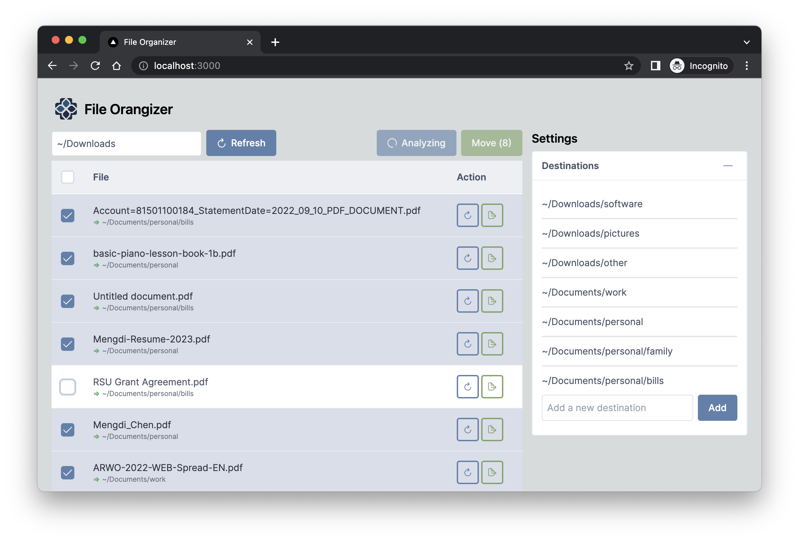

# File Organizer

AI-powered assistant to organize files on your computer.



## How it works
It reads files in a directory and moves them to a new directory based on the file name, type and content. The destination directory is determined by the LLM model (supports GPT or Claude by Anthropic).

## Setup

### Install dependencies

This project uses [Poetry](https://python-poetry.org/) for Python dependency management and NPM for JavaScript dependency management. Please have them both installed before proceeding.

Install the dependencies:

```bash
poetry update && cd file_organizer_ui && npm install
```

### Configuration

You need your own API key to run this project.
Copy `.env.example` to `.env` and fill in the values. At least one of the following is required:
- `openai_api_key`
- `anthropic_api_key`

## Usage

First, start the backend server:

```bash
poetry run flask run
```

Then, start the UI:

```bash
cd file_organizer_ui && npm run dev
```

Visit http://localhost:3000/ to use the UI.

